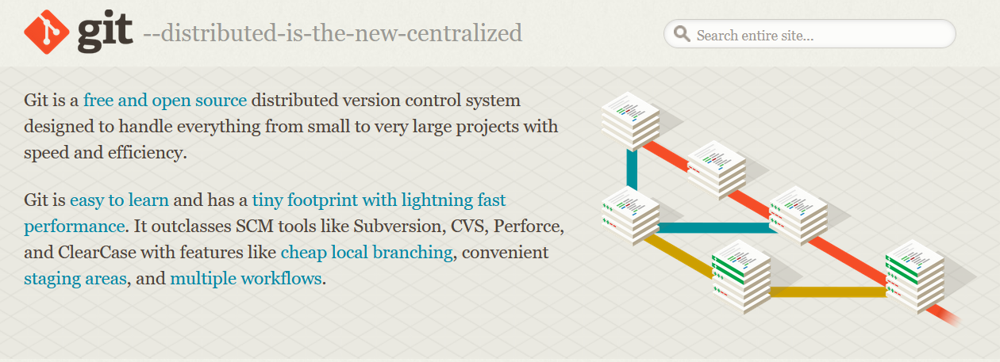
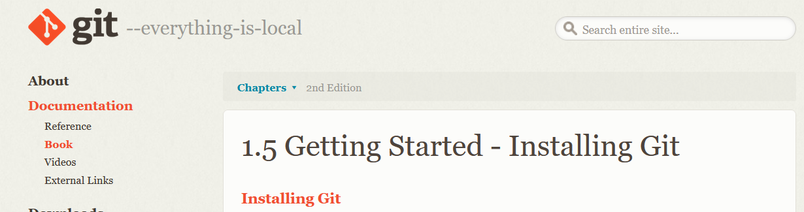
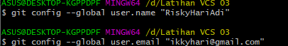
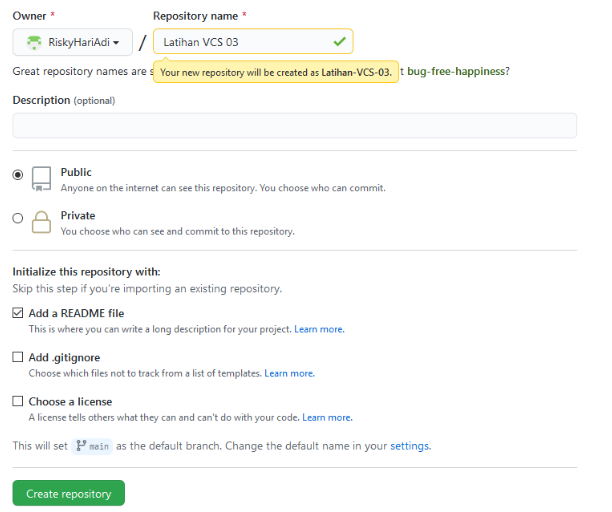

# LatihanVCS03

**Nama :RiskyHariAdi**  

**Nim  :312010124**  

**Kelas:TI.20.A1**  

## Langkah-Langkah Penggunaan Git

* Dwonload git terlebih dahulu, dengan link berikut : [click here](https://git-scm.com)  

* setelah file terdownload, silahkan lakukan instalasi dengan referensi berikut ini : [Git installation guide](https://git-scm.com/book/en/v2/Getting-Started-Installing-Git)  

  

* setelah installasi selesai, buka *software* **GitBash** pada menu di Windows, dan lakukan pengecekan **versi**, dengan mengetik *syntax* berikut :  

`git --version`  

  

* jika muncul tampilan **git version**,berarti Git sudah **berhasil di install** dan bisa di **gunakan** Langkah pertama kita harus **mengkonfirmasikan user name** dan **email di git**, dengan mengetikkan *syntax* berikut :  

`git commit --global user.name "masukkan nama anda"`  

`git commit --global user.email "masukkan email anda"`  

  

* Buat akun di **GitHub**, seperti contoh dibawah ini. Dan lakukan verifikasi akun melalui email yang sudah terdaftar.

* Jika akun  **GitHub** sudah selesai dibuat dan di verifikasi, proses selanjutnya silahkan buat Repository seperti gambar dibawah ini :  
**Penjelasan**

> * `Repository Name : (silahkan isi nama repository yang diinginkan seperti contoh saya ingin membuat repository Latihan VCS 03)`  

> * `Description : (Isi dengan deskripsi atau penjelasan tentang repository Anda)`  

> * `Public / Private : (PIlih salah satu jenis repository akan bisa dilihan sama semua orang atau tidak)`  

> * `Add a README.md file : Centang pada bagian ini jika Anda menginginkan file README.md ada di repository Anda`  

> * `Add .gitignore : Merupakan sebuah file yang berisi daftar nama-nama file dan direktori yang akan diabaikan oleh Git.`  

> * `Choose a license : Silahkan centang jika Anda memiliki lisensi pada repository yang akan dibuat Kemudian tekan tombol Create Repository untuk menyimpan`  

  

